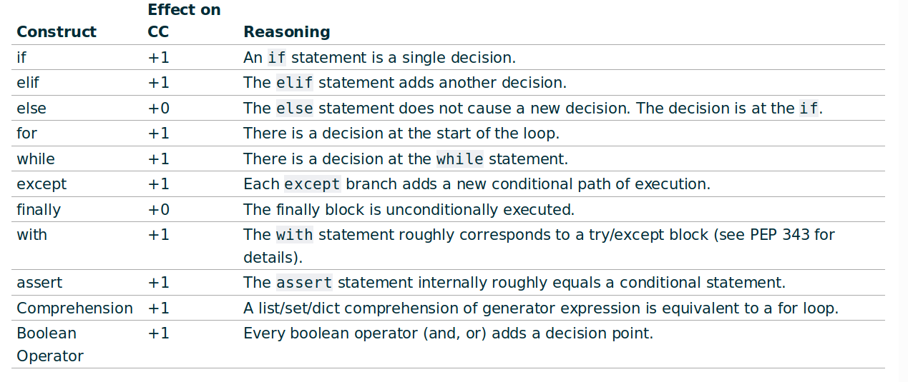
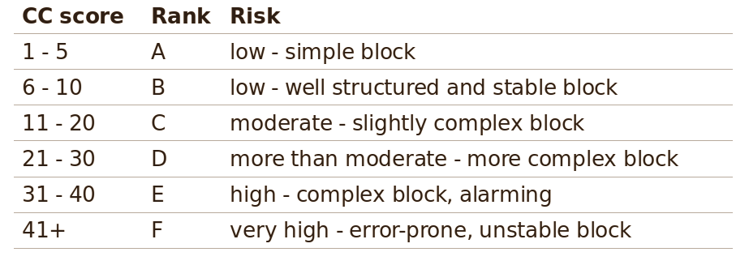

= Zaawansowane jezyki progdamowania


=== Plugins:
:icons: font

[options="header,footer"]
|=======================
| N |Nazwa		|Opis      	
|1|http://cloc.sourceforge.net/[cloc] 		
|count     	

|2|https://radon.readthedocs.io/en/latest/[radon]  
|computes various metrics

|3|https://github.com/rubik/xenon[xenon]		
|monitor code complexity using radon

|4|http://pylint.pycqa.org/en/latest/intro.html[pylint]		
|looks for programming errors and some code smells, `pyreverse` (for UML diagram) and `symilar` (a similarities checker)

|5|https://pypi.org/project/prospector/[prospector]	
|prospector is a tool to analyse Python code and output information about errors, potential problems, convention violations and complexity. ToolBase: pylint

|6|https://github.com/PyCQA/pycodestyle[pycodestyle] 	
|check Python style conventions


|=======================

=== Editors:
	* VS code
	* eclipse
	
===== 1. Discovering a pain in the code

.SegmentedSieve.py 

[source, python]
```python
import math
def sieve(n):	                                        # (14)
    in_prime = []
    start = 2
    end   = int(math.sqrt(n)) ## Size of every segment
    temp = [True] * (end + 1)
    prime = []
     while((start <= end) and 1):                       # +2 = (14)
        if temp[start] == True:	                        # +1 = (12)
            in_prime.append(start)
            for i in range(start*start, end+1, start):  # +1 = (11)
                if temp[i] == True:	                    # +1 = (10)
                    temp[i] = False
        start += 1
    prime += in_prime
    low = end + 1
    high = low + end - 1
    if high > n:	                                    # +1 = (9)
        high = n
    while(low <= n):	                                # +1 = (8)
        temp = [True] * (high-low+1)
        for each in in_prime:	                        # +1 = (7)
            t = math.floor(low / each) * each           # +1 = (6)
            if t < low:		                            # +1 = (5)
                t += each
            for j in range(t, high+1, each):	        # +1 = (4)
                temp[j - low] = False
        for j in range(len(temp)):		                # +1 = (3)
            if temp[j] == True:		                    # +1 = (2)
                prime.append(j+low)
        low = high + 1
        high = low + end - 1
        if high > n:	                                # +1  = (1)
            high = n
    return prime
print(sieve(10**6))
```

```sh
radon cc -s SegmentedSieve.py   # cc (compute Cyclomatic Complexity)	-s (show complexity)
    F 3:0 sieve - C (14)        # (14)
```



